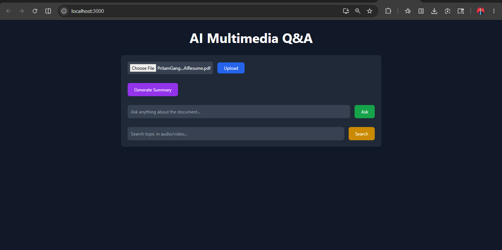
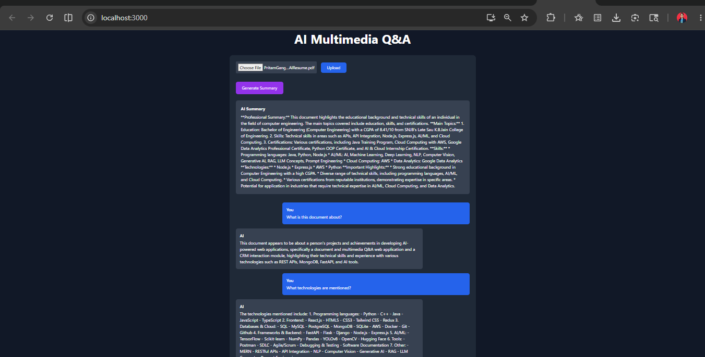
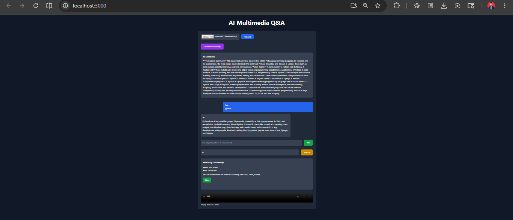

# AI-Powered Document & Multimedia Q&A Web Application

## Overview

This project is a full-stack AI-powered application that allows users to upload PDF documents, audio files, and video files and interact with them using an intelligent chatbot.

The application supports:

* AI-powered question answering
* Document summarization
* Audio/video transcription
* Semantic search using vector embeddings
* Timestamp extraction from multimedia
* Media playback from relevant timestamps

The system is built using a Retrieval-Augmented Generation (RAG) architecture with FastAPI, React.js, FAISS, Whisper, and LLM integration.

---

# Features

## Document Features

* Upload PDF files
* Extract document text
* Generate AI summaries
* Ask questions based on uploaded documents
* Semantic search using vector embeddings

## Multimedia Features

* Upload MP3, WAV, and MP4 files
* Speech-to-text transcription using Faster Whisper
* Extract timestamps from audio/video
* Search topics inside multimedia files
* Jump directly to relevant timestamps using media player

## Chatbot Features

* Conversational chatbot UI
* Chat history support
* AI-generated responses
* Context-aware semantic retrieval

## UI Features

* Modern dark-themed UI
* Responsive frontend
* React-based chatbot interface
* Timestamp search interface

---

# Tech Stack

## Frontend

* React.js
* Tailwind CSS
* Axios
* React Player

## Backend

* FastAPI
* Python

## AI & ML

* Groq/OpenAI LLM
* LangChain
* FAISS Vector Database
* HuggingFace Embeddings
* Faster Whisper

## Tools & Deployment

* Docker
* Docker Compose
* GitHub
* Vercel
* Render

---

# Architecture

User Upload → Text/Transcription Extraction → Chunking → Embeddings → FAISS Vector Store → Semantic Retrieval → LLM Response

---

# Project Structure

```bash
ai-multimedia-qa/
│
├── backend/
│   ├── app/
│   │   ├── routes/
│   │   ├── services/
│   │   └── main.py
│   ├── uploads/
│   ├── vectors/
│   ├── requirements.txt
│   └── Dockerfile
│
├── frontend/
│   ├── src/
│   │   ├── components/
│   │   ├── App.js
│   │   └── api.js
│   ├── package.json
│   └── Dockerfile
│
├── docker-compose.yml
└── README.md
```

---

# Installation & Setup

## Clone Repository

```bash
git clone https://github.com/pritt18/ai-multimedia-qa.git

cd ai-multimedia-qa
```

---

# Backend Setup

```bash
cd backend

python -m venv venv

# Windows
venv\Scripts\activate

pip install -r requirements.txt

uvicorn app.main:app --reload
```

Backend runs on:

```bash
http://127.0.0.1:8000
```

---

# Frontend Setup

```bash
cd frontend

npm install

npm start
```

Frontend runs on:

```bash
http://localhost:3000
```

---

# Environment Variables

Create a `.env` file inside `backend/`

```env
GROQ_API_KEY=your_api_key
```

or

```env
OPENAI_API_KEY=your_api_key
```

---

# Docker Setup

## Build & Run

```bash
docker-compose up --build
```

---

# API Endpoints

## Upload File

```http
POST /upload
```

## Ask Questions

```http
POST /chat
```

## Generate Summary

```http
POST /summary
```

## Search Timestamps

```http
POST /timestamps
```

---

# Example Workflow

1. Upload PDF/audio/video
2. Backend extracts text/transcription
3. Text converted into embeddings
4. Embeddings stored in FAISS vector database
5. User asks questions
6. Relevant context retrieved using semantic similarity
7. LLM generates final answer

---

# AI Workflow

## PDF Pipeline

PDF → Text Extraction → Chunking → Embeddings → FAISS → LLM

## Multimedia Pipeline

Audio/Video → Whisper Transcription → Timestamp Extraction → FAISS → LLM

---

# Screenshots

## Dashboard



## Chatbot UI



## Timestamp Search



---

# Future Improvements

* User Authentication
* Streaming AI Responses
* MongoDB Integration
* Cloud Storage
* Multi-file Context Search
* Real-time Collaboration

---

# Demo Video

https://drive.google.com/file/d/1S2IXzugnJpjdB7DYgMg1KzWSwbuz0jQU/view?usp=sharing


---

# Live Deployment

Frontend:
https://ai-multimedia-qa-ochre.vercel.app

Backend:
https://ai-multimedia-qa-rbmk.onrender.com/docs

---

# Author

Pritam Gangurde

LinkedIn:
https://www.linkedin.com/in/pritam-gangurde-b51528249

GitHub:
https://github.com/pritt18

Email:
pritamgangurde18@gmail.com

---

# Conclusion

This project demonstrates practical implementation of:

* Retrieval-Augmented Generation (RAG)
* Vector Databases
* Large Language Models
* Multimedia AI Processing
* Full-Stack AI Development

The application provides an intelligent and interactive way to explore documents and multimedia content using AI.
